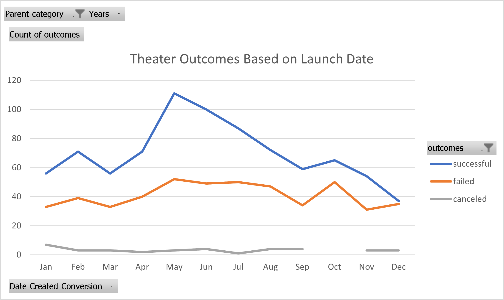

# Kickstarter Analysis with Excel

## Overview of Project
This analysis, by using statistical and other analytical tools in Excel, highlights the factors that impact the success of Kickstarter projects  with a view to making scientific recommendations on proposed projects.

### Purpose
The purpose of this analysis is to examine the impact of timing and goal size on the success of Kickstarter projects.

## Analysis and Challenges

### Analysis of Outcomes Based on Launch Date
The analysis of the kickstarter data reveals that theater projects created in May were more successful than those created in any other months of the year  and projects created in the months April to August had higher success than thos started any other period.

### Analysis of Outcomes Based on Goals
The analysis also reveals that projects with smaller goals had ahigher success rates than those with large goals. Particularly, projects with goals less than $5000 were  more than 70% successful. However, the relationship between project goal and success rate is not entirely linear through the range of goals.

## Results

* 1. The best time to launch a theater crowdfunding project is in the month of May  2. A lauch date between April and August has a high probability for success.

* a crowdfunding project for Plays with a goal of $5000 or less has a very high probability of success.

* One of the limitations of the dataset is that it doesn't show if all projects in the same category had similar exposure to the public or if there were some other  factors that determined how much publicity a project received.

* We could also make a table for number of backers for each category or sub-category to determine which projects are more popular.
